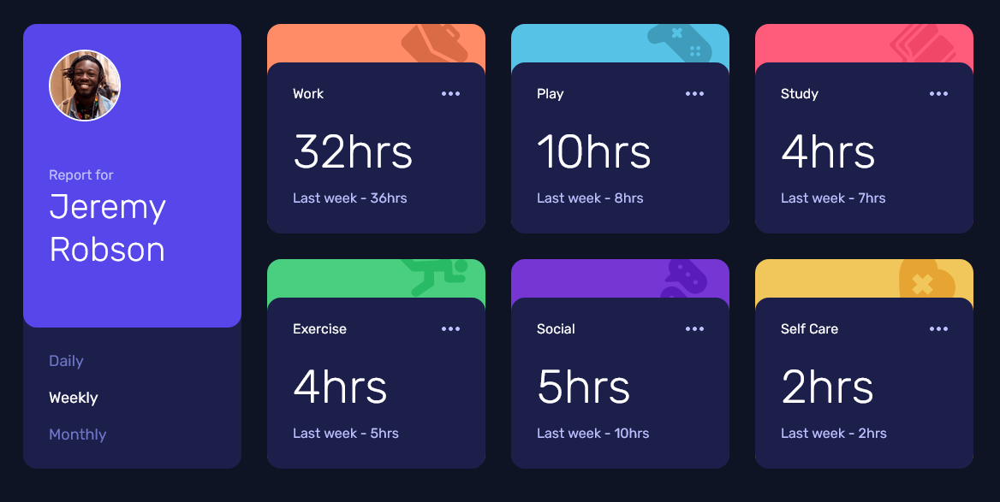
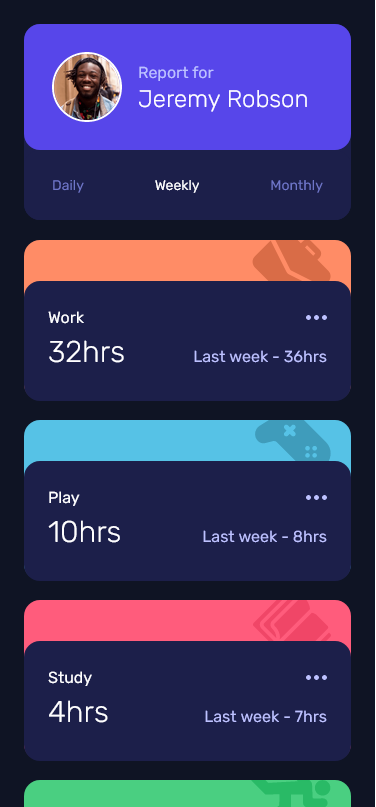

# Frontend Mentor - Time tracking dashboard solution

This is a solution to the [Time tracking dashboard challenge on Frontend Mentor](https://www.frontendmentor.io/challenges/time-tracking-dashboard-UIQ7167Jw). Frontend Mentor challenges help you improve your coding skills by building realistic projects.

## Table of contents

- [Overview](#overview)
  - [Links](#links)
  - [The challenge](#the-challenge)
  - [Screenshot](#screenshot)
- [My process](#my-process)
  - [Built with](#built-with)
- [Author](#author)

## Overview

### Links

- Live Site URL: [live demo](https://bayuprathama.github.io/time-tracking-dashboard/)

### The challenge

Users should be able to:

- View the optimal layout for the site depending on their device's screen size
- See hover states for all interactive elements on the page
- Switch between viewing Daily, Weekly, and Monthly stats

### Screenshot

## My process

### Built with

- Flexbox
- CSS Grid
- Mobile-first workflow
- Vite
- [React](https://reactjs.org/) - JS library
- [Tailwindcss](https://tailwindcss.com) - For styles

## Author

- Frontend Mentor - [@bayuprathama](https://www.frontendmentor.io/profile/bayuprathama)
- Twitter - [@bayuprathama\_](https://twitter.com/bayuprathama_)
